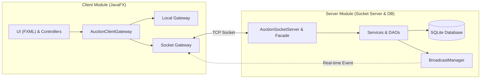

# BÁO CÁO BÀI TẬP LỚN: HỆ THỐNG ĐẤU GIÁ TRỰC TUYẾN REAL-TIME (AUCTRA)

**Thành viên thực hiện**:
1. Hồ Anh Khoa
2. Vũ Đức Minh
3. Lưu Ngọc Long
4. Phạm Phú Thành

---

## 1. Giới Thiệu Mục Tiêu & Phạm Vi Thực Hiện

### Mục tiêu
Mục tiêu của dự án **Auctra** là xây dựng một hệ thống đấu giá trực tuyến hoạt động theo thời gian thực (real-time). Hệ thống phải đảm bảo tính nhất quán của dữ liệu đặt giá khi có hàng ngàn Bidder tham gia đồng thời, xử lý tranh chấp giá một cách chính xác, đồng bộ hóa thông tin tức thời và mang lại giao diện người dùng hiện đại, trực quan, mượt mà.

### Phạm vi hệ thống
Hệ thống giải quyết trọn vẹn vòng đời của một phiên đấu giá trực tuyến:
- **Người dùng**: Phân chia vai trò rõ ràng gồm Admin (Quản trị hệ thống, duyệt người dùng, quản lý phiên đấu giá), Seller (Người đăng bán sản phẩm, theo dõi doanh thu, bắt đầu hoặc kết thúc phiên), và Bidder (Người mua, tham gia đặt giá, thiết lập tự động đấu giá).
- **Hệ thống Đấu giá**: Cho phép tạo sản phẩm kèm mô tả chi tiết, hình ảnh; tự động đếm ngược thời gian diễn ra phiên đấu giá; tự động xử lý khi hết hạn và chốt giao dịch.

---

## 2. Kiến Trúc Tổng Thể Hệ Thống

Hệ thống được thiết kế theo mô hình **Client - Server** phân tán, trao đổi dữ liệu qua TCP Socket và đồng bộ realtime dựa trên kiến trúc Event-Driven kết hợp với SQLite Database ở phía Server.

### Sơ đồ kiến trúc tổng thể

### Mô tả hoạt động theo kiến trúc
1. **Phía Client**: Giao diện người dùng viết bằng JavaFX, tách biệt phần bố cục (FXML) và CSS. Các `Controller` tiếp nhận tương tác của người dùng, gọi các phương thức tương ứng trên lớp `AuctionClientGateway`. Client hỗ trợ hai chế độ kết nối:
   - **Local Mode**: Gọi trực tiếp thông qua `AuctionServerFacade` (phù hợp để demo nhanh hoặc chạy đơn luồng).
   - **Socket Mode**: Đóng gói các yêu cầu thành JSON `AuctionRequest` và gửi qua kết nối TCP Socket thời gian thực đến Server.
2. **Phía Server**: `AuctionSocketServer` lắng nghe ở cổng `9999`. Khi nhận được `AuctionRequest`, nó giải mã và chuyển cho `AuctionServerFacade` để gọi đến lớp nghiệp vụ chuyên biệt (`Service`).
3. **Real-time Synchronization (Đồng bộ tức thời)**: Khi có một sự kiện thay đổi trạng thái quan trọng xảy ra (ví dụ: có lượt đặt giá mới, phiên đấu giá mới được tạo/kết thúc), `BroadcastManager` ở phía Server sẽ đẩy một `AuctionEvent` qua các kết nối socket đang mở tới toàn bộ Client đang kết nối để cập nhật giao diện ngay lập tức mà không cần F5 hoặc tải lại trang.

---

## 3. Trình Bày Chi Tiết Chức Năng Theo Barem Điểm

### 3.1. Thiết kế lớp & Cây kế thừa (OOP & Design Pattern)
- **Thiết kế Cây kế thừa**:
  - Lớp cha trừu tượng `User` định nghĩa các thuộc tính cơ bản (id, username, email, role, avatarPath).
  - Các lớp con `Bidder`, `Seller`, `Admin` kế thừa từ `User`, bổ sung các thông tin đặc thù (ví dụ: `Bidder` có phone, shipping address; `Seller` có storeName, storeDescription; `Admin` có department). Điều này đảm bảo tính đóng gói (Encapsulation) và kế thừa (Inheritance).
- **Áp dụng Đa hình (Polymorphism)**: Interface `AuctionClientGateway` định nghĩa các cổng giao tiếp dữ liệu. Tùy thuộc vào tham số khởi động của ứng dụng, hệ thống sẽ tiêm (inject) `LocalAuctionClientGateway` hoặc `SocketAuctionClientGateway` vào `AppContext`, giúp Client gọi các API hoàn toàn như nhau.
- **Design Pattern sử dụng**:
  - **Facade Pattern**: `AuctionServerFacade` làm điểm truy cập duy nhất đại diện cho toàn bộ hệ thống dịch vụ phía Backend Server, giúp giảm độ liên kết lỏng (loose coupling).
  - **Observer Pattern**: Lớp `Auction` quản lý danh sách `BidObserver`. Khi có giá thầu mới được thêm vào, các observer sẽ nhận thông báo để thực hiện ghi nhận, ghi log hoặc đẩy notification.
  - **Factory Pattern**: Lớp `ItemFactory` tạo ra các loại sản phẩm khác nhau (`Art`, `Electronics`, v.v.) dựa trên thông tin loại sản phẩm đầu vào.

### 3.2. Chức năng chính
- **Quản lý người dùng & sản phẩm**: Thực hiện đầy đủ tính năng Đăng nhập, Đăng ký (mã hóa mật khẩu bằng thuật toán PBKDF2 an toàn), thay đổi hồ sơ cá nhân và quản lý dữ liệu sản phẩm trong SQLite.
- **Chức năng đấu giá**: Đấu giá tuân thủ quy trình nghiêm ngặt: Tạo phiên (`OPEN`) -> Bắt đầu đấu giá (`RUNNING`) -> Kết thúc phiên (`FINISHED`) -> Xác nhận thanh toán (`PAID`).
- **Xử lý lỗi & Ngoại lệ**: Xây dựng cấu trúc Exception phân tầng (`AuctionException`, `ValidationException`, `InvalidBidException`), đảm bảo lỗi nghiệp vụ được chặn lại ở Service layer và dịch sang thông báo tiếng Việt hiển thị thân thiện lên màn hình Client.

### 3.3. Kỹ thuật quan trọng & Concurrency
- **Xử lý đấu giá đồng thời (Safe Concurrency)**: 
  - *Vấn đề*: Khi hàng chục Bidder cùng đặt giá (bid) ở một phần nghìn giây cuối cùng, có thể xảy ra tình trạng "Lost Update" hoặc "Race Condition" khiến giá cuối cùng bị sai lệch.
  - *Giải pháp*: Trong lớp `Auction.java`, mọi thao tác làm thay đổi trạng thái đấu giá (thêm lượt đặt giá `addBid()`, bắt đầu `start()`, kết thúc `finish()`) đều được bảo vệ bởi một khóa riêng biệt `ReentrantLock` (`stateLock`). Khóa này đảm bảo tại một thời điểm chỉ có một luồng duy nhất được quyền thay đổi giá trị hiện tại và ghi nhận danh sách đặt giá. Khi lưu xuống SQLite, toàn bộ lịch sử đấu giá được thực thi trong một Database Transaction (`setAutoCommit(false)`) giúp dữ liệu được lưu trữ đồng bộ, không bao giờ bị lỗi một nửa.
- **Real-time update (Socket Real-time)**: Xây dựng cơ chế TCP Server đa luồng. Mỗi client kết nối sẽ được quản lý bởi một luồng `ClientHandler` chuyên biệt. Khi nhận được một gói tin đặt giá thành công, server lập tức gọi `BroadcastManager` để duyệt qua toàn bộ danh sách kết nối đang hoạt động và gửi tín hiệu cập nhật, giúp màn hình của các Bidder khác hiển thị giá mới ngay lập tức.

---

## 4. Chức Năng Nâng Cao Đạt Được

### 4.1. Đấu giá tự động (Auto-Bidding) với PriorityQueue
- *Chức năng*: Người dùng thiết lập mức giá tối đa (`maxBid`) họ sẵn sàng trả và bước nhảy giá (`increment`). 
- *Giải pháp kỹ thuật*: Khi có người đặt giá mới, hệ thống tự động quét và kích hoạt cơ chế tự động đấu giá. Hệ thống sử dụng cấu trúc dữ liệu **`PriorityQueue`** (hàng đợi ưu tiên) dựa trên mức giá trần và thời gian đăng ký để giải quyết nhanh chóng và chính xác thứ tự trả giá của nhiều con bot tự động cùng lúc, đảm bảo người đặt giá trần cao nhất luôn giữ vị trí dẫn đầu mà không cần thao tác tay.

### 4.2. Chống bắn tỉa giá (Anti-sniping)
- *Chức năng*: Tránh tình trạng người mua cố tình đợi đến giây cuối cùng để đặt giá, làm giảm giá trị thực tế của sản phẩm.
- *Giải pháp kỹ thuật*: Trong `BidService`, khi có lượt đặt giá hợp lệ được gửi lên trong vòng 60 giây cuối cùng của phiên đấu giá, hệ thống sẽ tự động cộng thêm **60 giây** vào thời điểm kết thúc (`endTime`) và cập nhật đồng bộ thời gian mới này đến toàn bộ client đang kết nối.

### 4.3. Thiết lập thời gian kết thúc tùy chọn & Kết thúc thủ công
- *Chức năng*: Seller được quyền tự đặt thời gian kết thúc phiên đấu giá theo phút tùy thích (thay vì mặc định 5 phút) khi đăng bán sản phẩm. Đồng thời, Seller có nút **Kết thúc** thủ công khi phiên đang ở trạng thái `RUNNING` để đóng phiên bất cứ lúc nào.
- *Giải pháp kỹ thuật*: Thêm trường `durationMinutes` vào schema SQLite, Socket payload, và DTO mappers. Khi nhấn Bắt đầu phiên, thời điểm kết thúc được tính động bằng `LocalDateTime.now().plusMinutes(durationMinutes)`.

### 4.4. Trực quan hóa biến động giá theo thời gian thực (Real-time Line Chart)
- *Chức năng*: Hiển thị sự biến động của giá sản phẩm dưới dạng biểu đồ trực quan tại màn hình chi tiết đấu giá.
- *Giải pháp*: Sử dụng thành phần `LineChart` của JavaFX, liên kết trực tiếp với luồng sự kiện Socket. Mỗi khi nhận thông báo bid mới, một node dữ liệu mới (Giá thầu, Thời gian) sẽ được vẽ thêm vào biểu đồ theo thời gian thực một cách mượt mà.

---

## 5. Phân Chia Công Việc Nhóm (4 Thành Viên)

Để đảm bảo dự án hoàn thành đúng tiến độ, mã nguồn của hệ thống được phân chia cụ thể cho các thành viên phụ trách lập trình các phần tương ứng như sau:

| Thành viên | Nhiệm vụ phát triển mã nguồn chính | Kết quả đóng góp |
| :--- | :--- | :--- |
| **Hồ Anh Khoa** | - Phát triển cấu trúc cây kế thừa OOP (`User`, `Bidder`, `Seller`, `Admin`) và mô hình dữ liệu đấu giá lõi (`Auction`, `Item`, `BidTransaction`). - Thiết kế và phát triển giao thức truyền thông điệp TCP Socket (Custom Socket Protocol) giữa Client và Server. - Triển khai cơ chế đa luồng lắng nghe kết nối (`ClientHandler`), nhóm luồng (Thread Pool) và bộ phát sóng cập nhật (`BroadcastManager`). - Phát triển hệ thống quản lý sự kiện Client (`ClientEventManager`) để đồng bộ cập nhật giao diện JavaFX. | - Hoàn thành toàn bộ hệ thống thực thể nghiệp vụ cốt lõi. - Xây dựng thành công hạ tầng mạng Socket TCP đa luồng real-time bền bỉ. - Đảm bảo luồng sự kiện real-time đồng bộ mượt mà ở cả Client và Server. |
| **Vũ Đức Minh** | - Phát triển các Backend Services ở server (`AuthService`, `UserService`, `SellerService`, `BidService`). - Thiết kế SQLite Database, cơ chế persistence và viết các lớp truy xuất dữ liệu (`SqliteUserDao`, `SqliteAuctionDao`, `SqliteItemDao`). - Triển khai thuật toán **Auto-Bidding** sử dụng **PriorityQueue** để tối ưu hóa việc tự động đặt giá. | - Cơ sở dữ liệu SQLite tối ưu, thực thi các truy vấn DAO qua transactions an toàn. - Chức năng tự động đấu giá chạy chính xác, xử lý tranh chấp giá tự động tốt. |
| **Lưu Ngọc Long** | - Xây dựng giao diện UI (JavaFX + FXML) và các Layout Views cho Client (Đăng nhập, Đăng ký, Profile, các màn hình Dashboard của Admin, Seller, Bidder). - Thiết kế, tối ưu hóa CSS tùy chỉnh cho hệ thống giao diện (Auctra Design System). - Triển khai tính năng **Bid History Visualization** (vẽ biểu đồ đường giá realtime bằng LineChart). | - Giao diện hiện đại, trực quan, đồng bộ responsive tốt. - Biểu đồ biến động giá vẽ động realtime mượt mà khi có sự kiện bid mới. |
| **Phạm Phú Thành** | - Phát triển Client Gateways để giao tiếp dữ liệu (`LocalAuctionClientGateway`, `SocketAuctionClientGateway`). - Triển khai logic nâng cao **Gia hạn phiên đấu giá (Anti-sniping)**. - Triển khai tính năng **Tùy chọn thời gian kết thúc & Kết thúc thủ công** cho Seller. - Phát triển các bộ Unit Tests (JUnit 5) kiểm thử logic nghiệp vụ cốt lõi và concurrency. | - Client kết nối đồng bộ và nhận sự kiện real-time tốt. - Tính năng Anti-Sniping và thời gian tùy chỉnh hoạt động đúng nghiệp vụ. - Suite unit test phong phú đảm bảo hệ thống không bị lỗi tranh chấp (concurrency). |
