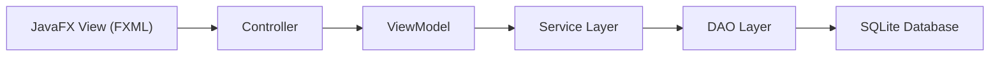
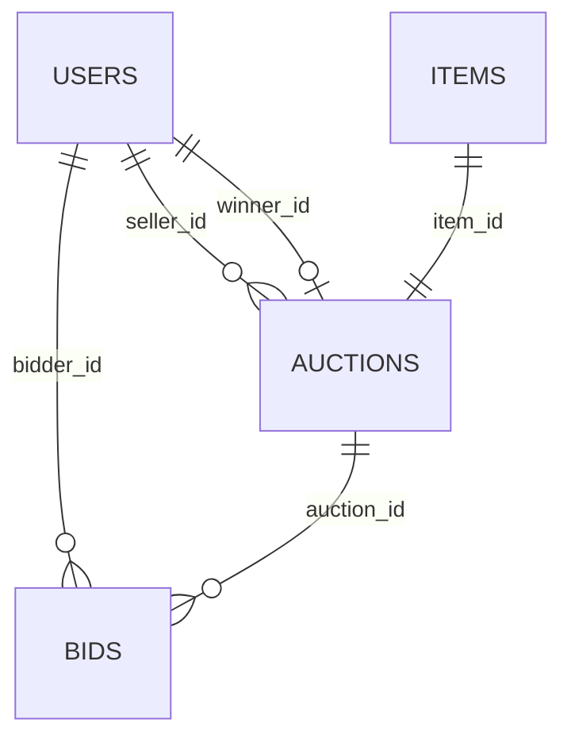

# Báo Cáo Chấm Tiến Độ Bài Tập Lớn

## 1. Mục tiêu buổi chấm tiến độ

Theo yêu cầu hiện tại, nhóm chưa bắt buộc phải hoàn thiện tất cả tính năng, nhưng cần có các phần nền tảng sau:

- thiết kế database
- thiết kế lớp cho client và server
- mô tả cách giao tiếp giữa client và server
- mô tả cách giao tiếp giữa server và database
- có giao diện để demo
- có hướng xử lý realtime update nếu cần

Báo cáo này tổng hợp đúng theo các tiêu chí trên, dựa trên code hiện đang có trong project.

## 2. Đánh giá nhanh tiến độ hiện tại

### Mức độ hoàn thành theo góc nhìn chấm tiến độ

Nếu xét theo yêu cầu của buổi chấm tiến độ, project hiện đã có phần khung cốt lõi và có thể demo được:

- có `database` thật bằng `SQLite`
- có tầng `DAO`, `Service`, `Controller`, `ViewModel`
- có giao diện `JavaFX`
- có luồng đăng nhập, xem danh sách auction, đặt giá, kết thúc phiên
- có xử lý ngoại lệ, kiểm thử và concurrent bidding

Nếu xét theo mức độ hoàn thiện của sản phẩm cuối kỳ, project vẫn còn thiếu:

- tách `client` và `server` thành hai tiến trình độc lập
- giao tiếp qua `socket`, `REST API` hoặc `WebSocket`
- realtime update giữa nhiều máy
- màn hình chi tiết auction và seller flow đầy đủ
- xác thực tài khoản hoàn chỉnh bằng password

### Kết luận ngắn

Project hiện phù hợp để chấm tiến độ vì đã có:

- kiến trúc phần mềm rõ
- dữ liệu lưu thật
- giao diện chạy được
- nghiệp vụ chính hoạt động
- test pass

## 3. Kiến trúc hiện tại của hệ thống

Hiện tại hệ thống đang ở dạng `desktop monolith có phân tầng rõ ràng`.

### 3.1. Phân tầng chính

1. `Client layer`
   - `JavaFX`
   - `FXML`
   - `Controller`
   - `ViewModel`

2. `Business / Server layer`
   - `AuthService`
   - `AuctionService`
   - `BidService`
   - `SellerService`
   - `AuctionManager`

3. `Persistence layer`
   - `DatabaseManager`
   - `SqliteUserDao`
   - `SqliteItemDao`
   - `SqliteAuctionDao`

4. `Domain model`
   - `Auction`
   - `BidTransaction`
   - `User`, `Seller`, `Bidder`, `Admin`
   - `Item`, `Art`, `Electronics`, `Vehicle`

### 3.2. Sơ đồ luồng tổng quát



### 3.3. Đánh giá về client và server

Hiện tại:

- `client` là phần JavaFX giao diện người dùng
- `server` đang được mô hình hóa bằng `service layer` trong cùng một ứng dụng

Nói cách khác, project đã có thiết kế lớp theo vai trò `client/server`, nhưng chưa tách thành hai chương trình chạy riêng. Đây là điểm cần nói rõ khi đi chấm để tránh bị hiểu là đã có network server hoàn chỉnh.

## 4. Các thành phần đã làm được

### 4.1. Giao diện người dùng

Đã có:

- màn hình `Login`
- màn hình `Auction List`
- CSS cơ bản
- điều hướng scene bằng `SceneNavigator`

File chính:

- [Main.java](/D:/BaitaplonTest/src/main/java/com/auction/Main.java)
- [SceneNavigator.java](/D:/BaitaplonTest/src/main/java/com/auction/app/SceneNavigator.java)
- [AuthController.java](/D:/BaitaplonTest/src/main/java/com/auction/controller/AuthController.java)
- [AuctionController.java](/D:/BaitaplonTest/src/main/java/com/auction/controller/AuctionController.java)
- [login-view.fxml](/D:/BaitaplonTest/src/main/resources/fxml/login-view.fxml)
- [auction-list-view.fxml](/D:/BaitaplonTest/src/main/resources/fxml/auction-list-view.fxml)

Đã có thể demo:

- đăng nhập bằng tài khoản mẫu
- hiển thị danh sách auction
- bidder đặt giá
- tài khoản khác kết thúc auction
- refresh lại danh sách

### 4.2. Logic nghiệp vụ chính

Đã có:

- tạo item
- tạo auction
- start auction
- finish auction
- mark paid
- place bid
- validate dữ liệu đầu vào
- custom exception

File chính:

- [AuthService.java](/D:/BaitaplonTest/src/main/java/com/auction/service/AuthService.java)
- [AuctionService.java](/D:/BaitaplonTest/src/main/java/com/auction/service/AuctionService.java)
- [BidService.java](/D:/BaitaplonTest/src/main/java/com/auction/service/BidService.java)
- [SellerService.java](/D:/BaitaplonTest/src/main/java/com/auction/service/SellerService.java)
- [Auction.java](/D:/BaitaplonTest/src/main/java/com/auction/model/auction/Auction.java)

### 4.3. Xử lý đa luồng và cạnh tranh tài nguyên

Đã có:

- `Observer Pattern` cho bid mới
- `synchronized` trong service khi đặt giá
- `ReentrantLock` trong `Auction`
- test concurrent bidding

Ý nghĩa:

- tránh lost update
- tránh race condition khi nhiều thread cùng bid
- bảo vệ state transition và cập nhật giá hiện tại

### 4.4. Database

Đã có database thật bằng `SQLite`.

File chính:

- [DatabaseManager.java](/D:/BaitaplonTest/src/main/java/com/auction/db/DatabaseManager.java)
- [schema.sql](/D:/BaitaplonTest/src/main/resources/db/schema.sql)
- [SqliteUserDao.java](/D:/BaitaplonTest/src/main/java/com/auction/dao/sqlite/SqliteUserDao.java)
- [SqliteItemDao.java](/D:/BaitaplonTest/src/main/java/com/auction/dao/sqlite/SqliteItemDao.java)
- [SqliteAuctionDao.java](/D:/BaitaplonTest/src/main/java/com/auction/dao/sqlite/SqliteAuctionDao.java)

Database hiện lưu:

- users
- items
- auctions
- bids

### 4.5. Kiểm thử

Đã có test cho:

- service
- model
- in-memory DAO
- SQLite persistence
- concurrent bidding

Kết quả xác minh hiện tại:

- chạy `mvn test` thành công
- `60 tests`
- `0 failures`
- `0 errors`

## 5. Thiết kế database

### 5.1. Các bảng chính

1. `users`
   - lưu người dùng
   - phân vai trò `SELLER`, `BIDDER`, `ADMIN`

2. `items`
   - lưu vật phẩm đấu giá
   - gồm tên, mô tả, giá khởi điểm, loại item

3. `auctions`
   - lưu phiên đấu giá
   - liên kết đến item, seller, winner
   - lưu trạng thái và giá hiện tại

4. `bids`
   - lưu lịch sử đặt giá
   - liên kết tới auction và bidder

### 5.2. Quan hệ dữ liệu



### 5.3. Đánh giá

Thiết kế hiện tại đã đủ để:

- lưu tài khoản
- lưu vật phẩm
- lưu trạng thái phiên đấu giá
- lưu lịch sử bid
- khôi phục dữ liệu sau khi tắt ứng dụng

## 6. Luồng giao tiếp trong hệ thống

### 6.1. Giao tiếp giữa client và server

Hiện tại chưa phải giao tiếp qua mạng. Luồng hiện có là:

`JavaFX View -> Controller -> ViewModel -> Service`

Ví dụ:

- người dùng nhập email ở màn `Login`
- `AuthController` nhận input
- `LoginViewModel` xử lý logic
- `AuthService` xác thực email
- kết quả trả ngược về UI

### 6.2. Giao tiếp giữa server và database

Luồng hiện tại:

`Service -> DAO -> DatabaseManager -> SQLite`

Ví dụ:

- `BidService.placeBid(...)`
- tìm auction qua `SqliteAuctionDao`
- cập nhật bid trong model
- gọi `auctionDao.save(...)`
- `SqliteAuctionDao` ghi xuống bảng `auctions` và `bids`

### 6.3. Cách trình bày với thầy

Nên nói rõ:

- hiện tại hệ thống đã có phân lớp theo client/server/database
- nhưng `client-server` mới là `logical separation`, chưa phải `distributed system`
- nếu làm tiếp, nhóm sẽ tách service thành server riêng và client giao tiếp qua API hoặc socket

## 7. Phần realtime update

Hiện tại realtime mới ở mức nội bộ ứng dụng:

- có `Observer Pattern` để notify khi có bid mới
- có thể refresh danh sách auction trên GUI

Chưa có:

- đồng bộ realtime giữa nhiều máy
- push event qua socket/WebSocket

Nếu thầy hỏi hướng phát triển, câu trả lời hợp lý là:

- giữ lại `Observer` ở tầng nghiệp vụ
- nếu tách client-server thật thì dùng `WebSocket` hoặc polling ngắn
- khi có bid mới, server push cập nhật về client

## 8. Phần đã có thể demo ngay ngày mai

1. Chạy ứng dụng JavaFX
2. Đăng nhập bằng tài khoản demo
3. Hiển thị danh sách auction từ SQLite
4. Đặt giá bằng tài khoản bidder
5. Refresh để thấy giá thay đổi
6. Kết thúc auction bằng tài khoản khác
7. Giải thích lịch sử bid đã được lưu trong database

### Tài khoản demo

- `seller@auction.local`
- `bidder@auction.local`
- `admin@auction.local`

## 9. Phần còn thiếu hoặc chưa hoàn thiện

Đây là phần nên trình bày thẳng, không nên né:

1. Chưa tách `client` và `server` thành hai chương trình riêng
2. Chưa có giao tiếp mạng thật như `REST API`, `socket`, `WebSocket`
3. `auction-detail-view.fxml` mới là placeholder
4. `seller-view.fxml` mới là placeholder
5. `BidController.java` và `SellerController.java` hiện còn trống
6. Login mới dùng email, chưa có password
7. Realtime update giữa nhiều client chưa triển khai

## 10. Định hướng phát triển tiếp theo

Nếu được hỏi “bước tiếp theo nhóm sẽ làm gì”, có thể trả lời:

1. Tách server riêng
   - service layer chuyển thành backend server
   - client JavaFX gọi API

2. Hoàn thiện giao diện
   - auction detail
   - seller view
   - form tạo item và tạo auction

3. Nâng cấp xác thực
   - thêm password
   - phân quyền rõ hơn theo role

4. Realtime update
   - polling hoặc WebSocket

5. Quản lý database tốt hơn
   - migration
   - seed data rõ ràng
   - cấu hình theo môi trường

## 11. Bộ câu hỏi thầy có thể hỏi và câu trả lời gợi ý

### Câu 1. Dự án của em hiện đang làm đến đâu?

**Trả lời gợi ý:**

Hiện tại nhóm em đã hoàn thành phần khung chính của hệ thống: có giao diện JavaFX, có service xử lý nghiệp vụ, có SQLite database, có test, và đã demo được các luồng đăng nhập, xem danh sách auction, đặt giá và kết thúc phiên. Phần còn thiếu chủ yếu là tách client-server thật và realtime giữa nhiều client.

### Câu 2. Database của em gồm những bảng nào?

**Trả lời gợi ý:**

Database hiện có 4 bảng chính là `users`, `items`, `auctions`, `bids`. `users` lưu tài khoản và vai trò, `items` lưu vật phẩm, `auctions` lưu phiên đấu giá, còn `bids` lưu lịch sử đặt giá theo từng phiên.

### Câu 3. Vì sao em chọn SQLite?

**Trả lời gợi ý:**

Vì SQLite gọn, không cần cài server riêng, phù hợp để demo tiến độ nhanh và vẫn đủ để chứng minh nhóm đã có database thật. Sau này nếu cần mở rộng, bọn em có thể thay sang MySQL hoặc PostgreSQL vì đã tách DAO riêng.

### Câu 4. Client và server của em đang nằm ở đâu?

**Trả lời gợi ý:**

Hiện tại client là phần JavaFX giao diện người dùng. Server đang được mô hình hóa bằng service layer trong cùng ứng dụng, tức là mới tách logic theo tầng chứ chưa tách thành tiến trình mạng độc lập. Đây là bản prototype theo hướng monolith trước khi nâng cấp.

### Câu 5. Vậy giao tiếp client-server hiện giờ là gì?

**Trả lời gợi ý:**

Hiện giờ là giao tiếp nội bộ trong cùng chương trình. Luồng là `FXML -> Controller -> ViewModel -> Service`. Nếu phát triển tiếp, nhóm em sẽ đổi từ lời gọi nội bộ sang API hoặc socket.

### Câu 6. Server giao tiếp với database như thế nào?

**Trả lời gợi ý:**

Service không truy cập SQL trực tiếp mà đi qua DAO. DAO dùng `DatabaseManager` để mở kết nối JDBC tới SQLite. Cách này giúp code tách trách nhiệm rõ hơn và dễ thay database sau này.

### Câu 7. Em đã xử lý đa luồng hay cạnh tranh dữ liệu chưa?

**Trả lời gợi ý:**

Có. Phần đặt giá dùng `synchronized` ở service và `ReentrantLock` ở model `Auction`. Mục tiêu là tránh race condition và lost update khi nhiều luồng cùng đặt giá vào một auction.

### Câu 8. Em có làm realtime update chưa?

**Trả lời gợi ý:**

Hiện tại mới ở mức nội bộ bằng `Observer Pattern` để notify khi có bid mới. Nếu triển khai nhiều client thật thì nhóm em dự định dùng `WebSocket` hoặc polling để đẩy cập nhật từ server về client.

### Câu 9. Em đã kiểm thử những gì?

**Trả lời gợi ý:**

Nhóm em đã viết test cho model, service, DAO và persistence với SQLite. Hiện tại `mvn test` pass toàn bộ với `60 tests`, `0 failures`, `0 errors`.

### Câu 10. Những phần nào vẫn chưa xong?

**Trả lời gợi ý:**

Phần chưa xong gồm tách server riêng, realtime nhiều client, màn hình chi tiết auction, màn hình seller đầy đủ, và đăng nhập bằng password. Tuy nhiên khung kiến trúc hiện tại đã được chuẩn bị để phát triển tiếp.

### Câu 11. Nếu cho làm tiếp, em sẽ ưu tiên phần nào trước?

**Trả lời gợi ý:**

Em sẽ ưu tiên tách server riêng và chuẩn hóa luồng giao tiếp client-server trước, vì đó là bước quan trọng nhất để hệ thống tiến từ prototype desktop sang kiến trúc hoàn chỉnh hơn.

### Câu 12. Vì sao em dùng cả controller và viewmodel?

**Trả lời gợi ý:**

Controller chỉ nên xử lý tương tác UI và điều hướng. ViewModel giúp gom logic trình bày, giảm việc viết nghiệp vụ trong controller. Như vậy code dễ test hơn và gần với mô hình MVC/MVVM hơn.

### Câu 13. Em xử lý ngoại lệ như thế nào?

**Trả lời gợi ý:**

Bọn em dùng custom exception như `InvalidBidException`, `AuctionClosedException`, `AuthenticationException`, `ValidationException`. Service ném ra ngoại lệ phù hợp, còn ViewModel chuyển thành message để hiển thị trên giao diện.

### Câu 14. Làm sao chứng minh dữ liệu đã lưu thật chứ không chỉ in-memory?

**Trả lời gợi ý:**

Vì project dùng `SQLite` và có `SqlitePersistenceTest` để kiểm tra lưu rồi load lại auction từ database. Ngoài ra, khi tắt ứng dụng rồi chạy lại, dữ liệu vẫn còn vì được lưu trong file database.

### Câu 15. Nếu đổi từ SQLite sang MySQL thì có khó không?

**Trả lời gợi ý:**

Không quá khó vì nhóm em đã tách `DAO interface` với `Sqlite*Dao` implementation riêng. Khi đổi database chủ yếu là thay `DatabaseManager` và viết implementation DAO tương ứng.

### Câu 16. Vì sao nhóm em dùng `DAO` thay vì gọi SQL trực tiếp trong service?

**Trả lời gợi ý:**

Vì `DAO` giúp tách riêng tầng truy cập dữ liệu khỏi tầng nghiệp vụ. Service chỉ tập trung vào validation và business logic, còn DAO chịu trách nhiệm lưu và đọc dữ liệu. Cách này giúp code dễ test hơn, dễ thay database hơn và tránh để SQL rải rác trong toàn bộ project.

### Câu 17. Vì sao nhóm em vừa dùng `synchronized` vừa dùng `ReentrantLock`?

**Trả lời gợi ý:**

`synchronized` được dùng ở service để chặn nhiều luồng cùng đi vào thao tác đặt giá ở mức service call. `ReentrantLock` ở model `Auction` giúp bảo vệ trạng thái nội bộ của từng auction, nhất là khi cập nhật giá hiện tại, winner và lịch sử bid. Nói ngắn gọn là nhóm em khóa ở hai mức: mức service và mức domain object.

### Câu 18. Nếu có 2 người cùng đặt giá trong cùng một thời điểm thì hệ thống xử lý ra sao?

**Trả lời gợi ý:**

Hai request cùng bid sẽ đi qua phần khóa đồng bộ. Chỉ một luồng được cập nhật giá tại một thời điểm. Luồng vào sau sẽ đọc lại trạng thái mới nhất rồi mới kiểm tra điều kiện hợp lệ. Như vậy tránh được tình huống cả hai cùng ghi đè lên một mức giá cũ.

### Câu 19. Vì sao nhóm em chọn kiến trúc nhiều tầng như `Controller -> ViewModel -> Service -> DAO`?

**Trả lời gợi ý:**

Vì mỗi tầng có trách nhiệm rõ ràng: `Controller` xử lý sự kiện UI, `ViewModel` gom logic trình bày, `Service` xử lý nghiệp vụ, `DAO` truy cập dữ liệu. Khi tách như vậy, code dễ đọc hơn, dễ test hơn và có thể thay đổi một tầng mà ít ảnh hưởng tầng khác.

### Câu 20. Vì sao `BidController` và `SellerController` còn trống?

**Trả lời gợi ý:**

Hiện tại nhóm ưu tiên hoàn thiện các luồng chính đang demo được trước, nên logic đang tập trung ở `AuthController`, `AuctionController`, `ViewModel` và `Service`. `BidController` và `SellerController` được tạo sẵn để chuẩn bị mở rộng flow riêng cho bidder và seller ở giai đoạn tiếp theo.

### Câu 21. Em đã làm gì để đảm bảo chất lượng code ngoài việc chạy ứng dụng?

**Trả lời gợi ý:**

Ngoài việc chạy app, nhóm em có `unit test`, `integration test` với SQLite, và dùng Maven để build tự động. Gần đây nhóm cũng đã tích hợp `Checkstyle` để enforce coding convention và `GitHub Actions` để tự động chạy `mvn verify` khi push code.

### Câu 22. `mvn verify` của nhóm đang kiểm tra những gì?

**Trả lời gợi ý:**

`mvn verify` hiện chạy toàn bộ vòng build quan trọng gồm compile, test và `Checkstyle`. Nghĩa là nếu code lỗi biên dịch, test fail hoặc vi phạm rule style thì pipeline sẽ fail.

### Câu 23. Vì sao nhóm em tích hợp `GitHub Actions`?

**Trả lời gợi ý:**

Để khi push code lên GitHub thì hệ thống tự build và test lại, tránh tình trạng chạy được trên máy một người nhưng lỗi ở máy khác. Đây cũng là bước đầu của CI giúp nhóm kiểm soát chất lượng code tốt hơn.

### Câu 24. GitHub Actions của nhóm chạy trên hệ điều hành nào?

**Trả lời gợi ý:**

Workflow hiện được cấu hình chạy trên `Ubuntu`, `Windows` và `macOS`. Mục tiêu là kiểm tra tính ổn định của Maven build trên cả 3 môi trường phổ biến.

### Câu 25. Nếu thầy yêu cầu tách server riêng ngay bây giờ thì phần nào của code có thể tận dụng lại?

**Trả lời gợi ý:**

Phần tận dụng lại được nhiều nhất là `service layer`, `DAO layer`, `model`, `exception` và phần database hiện có. Chủ yếu cần thay lớp giao tiếp từ `JavaFX Controller/ViewModel` sang API hoặc socket, còn lõi nghiệp vụ có thể giữ.

### Câu 26. Điểm yếu lớn nhất của bản hiện tại là gì?

**Trả lời gợi ý:**

Điểm yếu lớn nhất là hệ thống chưa phải client-server phân tán thật. Hiện vẫn là ứng dụng desktop monolith có phân tầng. Realtime nhiều máy và xác thực hoàn chỉnh vẫn chưa xong.

## 12. Gợi ý cách trình bày miệng trong 1-2 phút

Có thể nói ngắn gọn như sau:

> Hiện tại nhóm em đã hoàn thành phần khung chính của hệ thống đấu giá. Ứng dụng đã có giao diện JavaFX, có đăng nhập, xem danh sách auction, đặt giá và kết thúc phiên. Ở tầng dữ liệu, bọn em đã chuyển từ in-memory sang SQLite với các bảng users, items, auctions và bids. Về kiến trúc, nhóm đã tách các lớp theo hướng client, service và database. Phần đa luồng và đồng bộ khi đặt giá cũng đã được xử lý bằng synchronized, ReentrantLock và có test xác minh. Phần còn thiếu là tách client-server thành hai tiến trình riêng, bổ sung realtime nhiều client và hoàn thiện thêm các màn hình còn placeholder.

## 12.1. Bản nói siêu ngắn trong 30 giây

> Nhóm em đang ở mức prototype desktop có phân tầng rõ ràng. Hệ thống đã có JavaFX GUI, service xử lý nghiệp vụ, SQLite database, test tự động, và demo được login, xem auction, đặt giá, kết thúc phiên. Bọn em cũng đã xử lý cạnh tranh đặt giá bằng cơ chế khóa và đã tích hợp Maven, Checkstyle, GitHub Actions để kiểm soát chất lượng code. Phần chưa xong là tách client-server thật và realtime giữa nhiều máy.

## 12.2. Các điểm thầy rất dễ hỏi vặn

Khi đi chấm, nên chủ động nói rõ 4 điểm này trước:

1. Hệ thống hiện là `desktop monolith`, chưa phải `distributed client-server`.
2. Realtime hiện mới ở mức nội bộ ứng dụng bằng `Observer`, chưa phải WebSocket nhiều máy.
3. Login hiện mới đủ để demo flow, chưa có password hoàn chỉnh.
4. `seller view`, `auction detail`, `BidController`, `SellerController` vẫn đang là phần phát triển tiếp theo.

Nếu nói thẳng từ đầu, thầy thường sẽ đánh giá nhóm nắm rõ phạm vi hiện tại hơn là cố trình bày quá mức.

## 12.3. Checklist trước khi đi chấm

Nên kiểm tra lại nhanh:

1. `mvn test` chạy pass.
2. `mvn verify` chạy pass.
3. App JavaFX mở được vào màn login.
4. Có sẵn tài khoản demo.
5. Có thể giải thích 4 bảng database.
6. Có thể nói rõ vì sao dùng `DAO`, `Service`, `SQLite`.
7. Có thể nói rõ điểm mạnh nhất và điểm còn thiếu nhất của project.

## 12.4. Luồng demo nên nói theo đúng code

Nếu thầy yêu cầu “em chỉ rõ luồng chạy trong code”, có thể trình bày theo đúng thứ tự này:

### Luồng 1. Khởi động ứng dụng

1. `Main.java` mở ứng dụng JavaFX.
2. `AppContext.java` tạo `DatabaseManager("jdbc:sqlite:auction-system.db")`.
3. `DatabaseManager.initializeSchema()` đọc [schema.sql](/D:/BaitaplonTest/src/main/resources/db/schema.sql) và tạo bảng nếu chưa có.
4. `AppContext` khởi tạo các DAO SQLite:
   - `SqliteUserDao`
   - `SqliteItemDao`
   - `SqliteAuctionDao`
5. `AppContext` tạo các service:
   - `AuthService`
   - `SellerService`
   - `AuctionService`
   - `BidService`
6. `seedData()` tạo dữ liệu demo nếu database đang trống.

### Luồng 2. Đăng nhập

1. User nhập email trên `login-view.fxml`.
2. `AuthController` nhận input từ UI.
3. `LoginViewModel.login(email)` gọi `AuthService.login(email)`.
4. `AuthService` kiểm tra email rỗng hay không.
5. `userDao.findByEmail(email)` tìm user trong database.
6. Nếu tìm thấy thì trả về `User`, nếu không thì ném `AuthenticationException`.
7. `LoginViewModel` đổi kết quả thành `LoginResult` để UI hiển thị thông báo.

### Luồng 3. Xem danh sách auction

1. `AuctionController` gọi `AuctionListViewModel.loadAuctions()`.
2. `AuctionListViewModel` gọi `AuctionService.listAuctions()`.
3. `AuctionService` gọi `auctionDao.findAll()`.
4. `SqliteAuctionDao.findAll()` đọc bảng `auctions`, sau đó map thêm:
   - `item`
   - `seller`
   - `winner`
   - `bids`
5. Kết quả được trả về UI để hiển thị danh sách.

### Luồng 4. Đặt giá

1. User nhập số tiền bid trên màn auction.
2. `AuctionListViewModel.placeBid(...)` parse số tiền.
3. `BidService.placeBid(auctionId, bidder, amount)` kiểm tra:
   - `auctionId` không rỗng
   - `bidder` không `null`
   - `amount > 0`
   - auction có tồn tại
4. Service dùng `synchronized (auction)` để chặn nhiều luồng vào cùng lúc.
5. `Auction.addBid(...)` dùng `ReentrantLock` để cập nhật:
   - danh sách `bids`
   - `currentPrice`
   - `winner`
6. `auctionDao.save(auction)` lưu lại toàn bộ trạng thái mới xuống SQLite.

### Luồng 5. Kết thúc auction

1. `AuctionListViewModel.finishAuction(auction)` gọi `AuctionService.finishAuction(auctionId)`.
2. `AuctionService` lấy auction theo id.
3. `Auction.finish()` đổi trạng thái từ `RUNNING` sang `FINISHED`.
4. `auctionDao.save(auction)` lưu lại trạng thái mới.

## 14. Phụ Lục Hỏi Đáp Chi Tiết Bám Code

Phần này dùng khi thầy hỏi sâu kiểu “em chỉ rõ trong code ở đâu”.

### Câu A. Lúc khởi động app thì hệ thống tạo những thành phần nào?

**Trả lời chi tiết:**

- `AppContext` là nơi ghép toàn bộ ứng dụng.
- Nó tạo `DatabaseManager`, khởi tạo schema, tạo DAO SQLite, sau đó tạo các service.
- Cuối cùng `seedData()` kiểm tra nếu chưa có auction thì sẽ tạo dữ liệu demo để mở app lên là có thể chạy ngay.

**File chứng minh:**

- [AppContext.java](/D:/BaitaplonTest/src/main/java/com/auction/app/AppContext.java)
- [DatabaseManager.java](/D:/BaitaplonTest/src/main/java/com/auction/db/DatabaseManager.java)

### Câu B. Dữ liệu demo hiện tại gồm những gì?

**Trả lời chi tiết:**

- Có 3 tài khoản:
  - `seller@auction.local`
  - `bidder@auction.local`
  - `admin@auction.local`
- Có 3 item:
  - `Gaming Laptop`, giá khởi điểm `1500.0`
  - `Used Sedan`, giá khởi điểm `8000.0`
  - `Landscape Painting`, giá khởi điểm `500.0`
- Seed hiện còn tạo các trạng thái khác nhau để dễ demo:
  - `laptopAuction` được start và đã có một bid `1700.0`
  - `artAuction` được start
  - `carAuction` được start, finish rồi mark paid

**File chứng minh:**

- [AppContext.java](/D:/BaitaplonTest/src/main/java/com/auction/app/AppContext.java)

### Câu C. Vì sao login hiện tại chỉ dùng email?

**Trả lời chi tiết:**

- Đây là quyết định chủ động để giảm độ phức tạp ở giai đoạn tiến độ.
- Nhóm ưu tiên hoàn thiện luồng kiến trúc, database, đấu giá, concurrency và GUI trước.
- `AuthService.login(email)` hiện chỉ xác thực sự tồn tại của email trong `users`.
- Nghĩa là phần login hiện là bản demo nghiệp vụ, chưa phải bản authentication hoàn chỉnh.

**File chứng minh:**

- [AuthService.java](/D:/BaitaplonTest/src/main/java/com/auction/service/AuthService.java)
- [LoginViewModel.java](/D:/BaitaplonTest/src/main/java/com/auction/presentation/LoginViewModel.java)

### Câu D. Tại sao auction mới tạo ra lại chưa bid được ngay?

**Trả lời chi tiết:**

- `Auction` khi mới tạo có trạng thái `OPEN`.
- Chỉ khi gọi `start()` thì trạng thái mới chuyển sang `RUNNING`.
- `Auction.addBid(...)` chỉ chấp nhận bid khi `status == RUNNING`.
- Mục đích là mô hình hóa vòng đời phiên đấu giá: tạo phiên trước, mở phiên sau.

**File chứng minh:**

- [Auction.java](/D:/BaitaplonTest/src/main/java/com/auction/model/auction/Auction.java)
- [AuctionStatus.java](/D:/BaitaplonTest/src/main/java/com/auction/enums/AuctionStatus.java)

### Câu E. Trạng thái auction hiện tại có những gì?

**Trả lời chi tiết:**

Các trạng thái hiện có:

- `OPEN`
- `RUNNING`
- `FINISHED`
- `PAID`
- `CANCELED`

Luồng trạng thái chính:

- `OPEN -> RUNNING`
- `RUNNING -> FINISHED`
- `FINISHED -> PAID`

Ngoài ra có thể `cancel()` từ:

- `OPEN`
- `RUNNING`
- `FINISHED`

**File chứng minh:**

- [AuctionStatus.java](/D:/BaitaplonTest/src/main/java/com/auction/enums/AuctionStatus.java)
- [Auction.java](/D:/BaitaplonTest/src/main/java/com/auction/model/auction/Auction.java)

### Câu F. Cụ thể một lần đặt giá đi qua những method nào?

**Trả lời chi tiết:**

Luồng thực tế:

1. `AuctionListViewModel.placeBid(...)`
2. `BidService.placeBid(...)`
3. `auctionDao.findById(...)`
4. `synchronized (auction)`
5. `Auction.addBid(...)`
6. `auctionDao.save(auction)`

Trong đó:

- tầng UI xử lý parse input và message lỗi
- tầng service xử lý validation nghiệp vụ
- tầng model cập nhật state thật của auction
- tầng DAO lưu state mới xuống SQLite

**File chứng minh:**

- [AuctionListViewModel.java](/D:/BaitaplonTest/src/main/java/com/auction/presentation/AuctionListViewModel.java)
- [BidService.java](/D:/BaitaplonTest/src/main/java/com/auction/service/BidService.java)
- [Auction.java](/D:/BaitaplonTest/src/main/java/com/auction/model/auction/Auction.java)
- [SqliteAuctionDao.java](/D:/BaitaplonTest/src/main/java/com/auction/dao/sqlite/SqliteAuctionDao.java)

### Câu G. Vì sao nhóm em dùng cả `synchronized` và `ReentrantLock`, có bị thừa không?

**Trả lời chi tiết:**

- `synchronized (auction)` trong `BidService` chặn hai luồng cùng xử lý một request bid trên cùng một object auction.
- `ReentrantLock stateLock` trong `Auction` bảo vệ trạng thái nội bộ của domain object khi gọi:
  - `start()`
  - `finish()`
  - `cancel()`
  - `markPaid()`
  - `addBid()`
- Nói ngắn gọn:
  - `synchronized` bảo vệ ở lớp service call
  - `ReentrantLock` bảo vệ ở lớp domain state

Không tối ưu tuyệt đối, nhưng hợp lý cho giai đoạn demo tiến độ vì dễ hiểu và an toàn hơn khi test concurrent.

**File chứng minh:**

- [BidService.java](/D:/BaitaplonTest/src/main/java/com/auction/service/BidService.java)
- [Auction.java](/D:/BaitaplonTest/src/main/java/com/auction/model/auction/Auction.java)

### Câu H. Test concurrent hiện đang chứng minh điều gì?

**Trả lời chi tiết:**

`ConcurrentBidTest` tạo 2 thread cùng chờ một `CountDownLatch`, sau đó cùng lúc bid vào một auction:

- bidder 1 bid `1200.0`
- bidder 2 bid `1500.0`

Sau khi chạy xong, test kiểm tra:

- `currentPrice == 1500.0`
- `winner == bidder2`
- có ít nhất một bid được ghi nhận
- danh sách lỗi rỗng hoặc tối đa có 1 lỗi

Ý nghĩa của `errors.isEmpty() || errors.size() == 1` là:

- trong đua tranh thực tế, một luồng có thể bị từ chối nếu giá của nó không còn cao hơn giá hiện tại sau khi luồng kia cập nhật xong
- điều đó là chấp nhận được và phản ánh đúng quy tắc nghiệp vụ

**File chứng minh:**

- [ConcurrentBidTest.java](/D:/BaitaplonTest/src/test/java/com/auction/concurrency/ConcurrentBidTest.java)

### Câu I. DAO SQLite hiện lưu auction xuống database theo cách nào?

**Trả lời chi tiết:**

`SqliteAuctionDao.save(...)` làm 3 bước trong một transaction:

1. `upsert` bảng `auctions`
2. `DELETE FROM bids WHERE auction_id = ?`
3. insert lại toàn bộ bids hiện có bằng `batch`

Lý do nhóm chọn cách này:

- code dễ hiểu
- đảm bảo trạng thái `auction` và `bids` đồng bộ với nhau
- phù hợp với quy mô demo hiện tại

Đây chưa phải cách tối ưu nhất cho hệ thống lớn, nhưng rất phù hợp cho bài tập lớn giai đoạn hiện tại.

**File chứng minh:**

- [SqliteAuctionDao.java](/D:/BaitaplonTest/src/main/java/com/auction/dao/sqlite/SqliteAuctionDao.java)

### Câu J. Vì sao cần `restoreState(...)` trong `Auction`?

**Trả lời chi tiết:**

Khi đọc dữ liệu từ database, nhóm không chỉ cần tạo object `Auction`, mà còn phải phục hồi:

- `status`
- `currentPrice`
- `winner`
- toàn bộ `bids`

`SqliteAuctionDao.mapAuction(...)` tạo object `Auction`, sau đó gọi `restoreState(...)` để nạp lại toàn bộ state đã lưu. Đây là lý do object sau khi load lại vẫn giữ đúng lịch sử và trạng thái cũ.

**File chứng minh:**

- [Auction.java](/D:/BaitaplonTest/src/main/java/com/auction/model/auction/Auction.java)
- [SqliteAuctionDao.java](/D:/BaitaplonTest/src/main/java/com/auction/dao/sqlite/SqliteAuctionDao.java)

### Câu K. Quan hệ database nào là quan trọng nhất?

**Trả lời chi tiết:**

Quan hệ quan trọng nhất là:

- `auctions.item_id -> items.id`
- `auctions.seller_id -> users.id`
- `auctions.winner_id -> users.id`
- `bids.auction_id -> auctions.id`
- `bids.bidder_id -> users.id`

Trong đó `bids.auction_id` có `ON DELETE CASCADE`, nghĩa là khi xóa auction thì toàn bộ bids của auction đó cũng bị xóa theo. Điều này giúp tránh dữ liệu mồ côi.

Ngoài ra `DatabaseManager.getConnection()` luôn bật:

```sql
PRAGMA foreign_keys = ON
```

để SQLite thực sự enforce các ràng buộc khóa ngoại.

**File chứng minh:**

- [schema.sql](/D:/BaitaplonTest/src/main/resources/db/schema.sql)
- [DatabaseManager.java](/D:/BaitaplonTest/src/main/java/com/auction/db/DatabaseManager.java)

### Câu L. Chất lượng code hiện được kiểm soát như thế nào?

**Trả lời chi tiết:**

Nhóm hiện kiểm soát chất lượng code ở 3 lớp:

1. `Maven`
   - chuẩn hóa build
   - chạy test bằng `mvn test`

2. `Checkstyle`
   - chạy trong `mvn verify`
   - kiểm tra các rule cơ bản như import thừa, star import, braces

3. `GitHub Actions`
   - tự động chạy `mvn -B verify`
   - chạy trên `ubuntu-latest`, `windows-latest`, `macos-latest`

Ý nghĩa là nếu code compile fail, test fail hoặc vi phạm Checkstyle thì CI sẽ fail luôn trên GitHub.

**File chứng minh:**

- [pom.xml](/D:/BaitaplonTest/pom.xml)
- [checkstyle.xml](/D:/BaitaplonTest/checkstyle.xml)
- [ci.yml](/D:/BaitaplonTest/.github/workflows/ci.yml)

### Câu M. Nếu thầy hỏi điểm chưa đẹp trong code hiện tại là gì thì trả lời sao?

**Trả lời chi tiết:**

Có thể trả lời thẳng như sau:

- login hiện mới theo email, chưa có password
- `ConsoleBidObserver` vẫn đang in console để phục vụ demo observer
- `BidController` và `SellerController` chưa phát triển đầy đủ
- một số màn hình mới là placeholder
- hệ thống chưa tách client-server thật

Trả lời kiểu này thường tốt hơn là cố nói project đã hoàn chỉnh.

**File chứng minh:**

- [ConsoleBidObserver.java](/D:/BaitaplonTest/src/main/java/com/auction/observer/ConsoleBidObserver.java)
- [BidController.java](/D:/BaitaplonTest/src/main/java/com/auction/controller/BidController.java)
- [SellerController.java](/D:/BaitaplonTest/src/main/java/com/auction/controller/SellerController.java)

## 13. Kết luận

Nếu chấm theo tiêu chí tiến độ hiện tại, project đã có nền tảng đủ tốt để trình bày:

- có thiết kế database
- có lớp theo vai trò client, service, DAO
- có giao diện chạy được
- có nghiệp vụ chính
- có kiểm thử

Điểm cần trình bày trung thực là hệ thống hiện vẫn là `prototype desktop có phân tầng`, chưa phải mô hình client-server phân tán hoàn chỉnh. Chính điểm này nên được nêu như phần phát triển tiếp theo thay vì cố trình bày là đã hoàn thiện.
